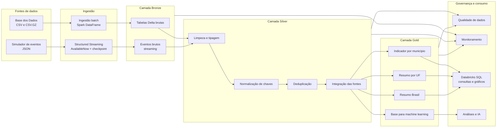

# Pipeline Híbrido para Análise da Alfabetização no Brasil

Pipeline de engenharia de dados desenvolvida no **Databricks** para integrar dados educacionais da Base dos Dados, processar cargas **batch e streaming**, aplicar regras de qualidade e disponibilizar datasets analíticos nas camadas **Bronze, Silver e Gold**.

O projeto foi desenvolvido como entrega do **Tech Challenge — Fase 2**, simulando uma solução de dados em nuvem para apoiar análises sobre alfabetização infantil, desigualdades territoriais e acompanhamento de metas educacionais.

---

## Sumário

- [1. Contexto do problema](#1-contexto-do-problema)
- [2. Objetivos](#2-objetivos)
- [3. Fontes de dados](#3-fontes-de-dados)
- [4. Arquitetura da solução](#4-arquitetura-da-solução)
- [5. Fluxo de dados](#5-fluxo-de-dados)
- [6. Camadas da Arquitetura Medalhão](#6-camadas-da-arquitetura-medalhão)
- [7. Ingestão batch e streaming](#7-ingestão-batch-e-streaming)
- [8. Qualidade e governança de dados](#8-qualidade-e-governança-de-dados)
- [9. Monitoramento e observabilidade](#9-monitoramento-e-observabilidade)
- [10. Tecnologias utilizadas](#10-tecnologias-utilizadas)
- [11. Decisões arquiteturais e trade-offs](#11-decisões-arquiteturais-e-trade-offs)
- [12. FinOps e controle de custos](#12-finops-e-controle-de-custos)
- [13. Aplicações em inteligência artificial](#13-aplicações-em-inteligência-artificial)
- [14. Estrutura do repositório](#14-estrutura-do-repositório)
- [15. Como executar](#15-como-executar)
- [16. Resultados da execução](#16-resultados-da-execução) (a execução com evidências de cada notebook está aqui!)
- [17. Estratégia de Git](#17-estratégia-de-git)
- [18. Limitações e evoluções futuras](#18-limitações-e-evoluções-futuras)
- [19. Referências](#19-referências)

---

## 1. Contexto do problema

A alfabetização na infância é uma condição essencial para o desenvolvimento educacional, social e econômico. Crianças que não consolidam competências básicas de leitura e escrita nos primeiros anos escolares enfrentam maior risco de defasagem de aprendizagem ao longo da trajetória escolar.

O **Compromisso Nacional Criança Alfabetizada** mobiliza União, estados, Distrito Federal e municípios para garantir que as crianças brasileiras estejam alfabetizadas ao final do 2º ano do ensino fundamental.

Em 2023, a **Pesquisa Alfabetiza Brasil**, conduzida pelo Instituto Nacional de Estudos e Pesquisas Educacionais Anísio Teixeira — Inep, estabeleceu o padrão nacional de alfabetização em **743 pontos na escala de proficiência do Saeb**. A partir desse parâmetro, o **Indicador Criança Alfabetizada** representa o percentual de estudantes que atingem o nível definido como adequado.

Entretanto, o acompanhamento da alfabetização exige a integração de dados com diferentes granularidades:

- resultados individuais de alunos;
- indicadores agregados por município;
- indicadores agregados por unidade federativa;
- metas nacionais;
- metas estaduais;
- metas municipais;
- atualizações de indicadores em tempo quase real.

Este projeto propõe uma pipeline híbrida para consolidar essas fontes em uma base analítica confiável, escalável e preparada para apoiar decisões públicas baseadas em evidências.

---

## 2. Objetivos

### Objetivo geral

Construir uma pipeline de dados em nuvem que integre dados educacionais relacionados à alfabetização infantil, utilizando processamento batch, streaming simulado, Arquitetura Medalhão, qualidade de dados, monitoramento e práticas de FinOps.

### Objetivos específicos

- ingerir dados históricos de diferentes entidades educacionais;
- simular atualizações incrementais de indicadores;
- preservar os dados originais na camada Bronze;
- padronizar tipos, nomes, chaves e valores na camada Silver;
- validar completude, unicidade, domínio e integridade referencial;
- criar datasets analíticos por município, UF e Brasil;
- registrar métricas operacionais da pipeline;
- disponibilizar uma base preparada para análises e modelos de machine learning;
- reduzir custos por meio de uma arquitetura serverless e processamento sob demanda.

---

## 3. Fontes de dados

Os dados foram obtidos no dataset **Avaliação da Alfabetização**, disponibilizado pela plataforma Base dos Dados.

### Entidades utilizadas

| Entidade | Finalidade |
|---|---|
| `alunos` | Microdados de estudantes, proficiência, presença e classificação de alfabetização |
| `municipio` | Indicadores educacionais agregados por município |
| `uf` | Indicadores educacionais agregados por unidade federativa |
| `meta_alfabetizacao_brasil` | Metas nacionais de alfabetização |
| `meta_alfabetizacao_uf` | Metas de alfabetização por UF |
| `meta_alfabetizacao_municipio` | Metas de alfabetização por município |

### Arquivos ingeridos

```text
alunos.csv
br_inep_avaliacao_alfabetizacao_municipio.csv.gz
br_inep_avaliacao_alfabetizacao_uf.csv.gz
br_inep_avaliacao_alfabetizacao_meta_alfabetizacao_brasil.csv.gz
br_inep_avaliacao_alfabetizacao_meta_alfabetizacao_uf.csv.gz
br_inep_avaliacao_alfabetizacao_meta_alfabetizacao_municipio.csv.gz
```

Os arquivos não são versionados no GitHub. Eles são armazenados em um **Unity Catalog Volume**, evitando o armazenamento de arquivos grandes e dados brutos no repositório.

---

## 4. Arquitetura da solução

A solução utiliza uma arquitetura **Lakehouse** no Databricks, combinando características de data lake e data warehouse.

O armazenamento é feito em tabelas **Delta Lake**, enquanto o processamento é realizado com **Apache Spark e PySpark**. A organização dos dados segue a **Arquitetura Medalhão**, com evolução progressiva da qualidade entre as camadas Bronze, Silver e Gold.

### Diagrama da pipeline



---

## 5. Fluxo de dados

1. Os arquivos históricos são enviados ao Volume `landing`.
2. O notebook de ingestão batch lê arquivos CSV e CSV.GZ.
3. As colunas são preservadas como texto na Bronze.
4. Metadados técnicos de ingestão são adicionados.
5. Um simulador produz dois lotes de eventos JSON.
6. O Spark Structured Streaming processa os arquivos incrementalmente.
7. A Silver converte tipos, normaliza chaves e remove duplicidades.
8. As bases de alunos, municípios, UFs, metas e eventos são integradas.
9. A Gold calcula indicadores, diferenças para metas e classificações.
10. Regras de qualidade são executadas e persistidas.
11. Métricas de execução e armazenamento são registradas.
12. Views e consultas analíticas são disponibilizadas para consumo.

---

## 6. Camadas da Arquitetura Medalhão

### 6.1 Bronze — dados brutos

A Bronze preserva os dados próximos ao formato original.

Principais características:

- leitura de CSV e CSV.GZ;
- preservação das colunas originais;
- ausência de transformação de negócio;
- armazenamento em Delta Lake;
- inclusão de metadados de rastreabilidade;
- histórico dos eventos recebidos por streaming.

Metadados adicionados:

```text
_ingestion_timestamp
_ingestion_date
_batch_id
_source_file
_source_system
_ingestion_type
```

Tabelas:

```text
alfabetizacao_bronze.alunos
alfabetizacao_bronze.municipio
alfabetizacao_bronze.uf
alfabetizacao_bronze.meta_alfabetizacao_brasil
alfabetizacao_bronze.meta_alfabetizacao_uf
alfabetizacao_bronze.meta_alfabetizacao_municipio
alfabetizacao_bronze.eventos_indicador_stream
```

### 6.2 Silver — dados tratados e integrados

A Silver aplica regras explícitas de tratamento e cria contratos de dados conhecidos.

Transformações realizadas:

- conversão de nomes de colunas para `snake_case`;
- conversão de ano para inteiro;
- conversão de indicadores e proficiências para `double`;
- conversão de variáveis binárias para booleano;
- padronização de códigos de município;
- padronização de siglas de UF;
- normalização de redes de ensino;
- remoção de duplicidades;
- validação de percentuais entre 0 e 100;
- deduplicação dos eventos por `id_evento`;
- expansão das metas anuais para formato longitudinal;
- criação das dimensões de municípios e UFs;
- integração de municípios encontrados nos microdados.

Tabelas:

```text
alfabetizacao_silver.fato_alunos
alfabetizacao_silver.fato_municipio
alfabetizacao_silver.fato_uf
alfabetizacao_silver.meta_alfabetizacao_brasil
alfabetizacao_silver.meta_alfabetizacao_uf
alfabetizacao_silver.meta_alfabetizacao_municipio
alfabetizacao_silver.eventos_indicador
alfabetizacao_silver.dim_municipio
alfabetizacao_silver.dim_uf
```

### 6.3 Gold — dados analíticos

A Gold disponibiliza tabelas prontas para consultas, visualizações e aplicações de IA.

#### `indicador_municipio`

Combina:

- indicador oficial;
- indicador calculado a partir dos microdados;
- atualização recebida por streaming;
- meta municipal;
- quantidade de alunos;
- proficiência média;
- diferença para a meta;
- classificação do município.

Principais classificações:

```text
META_ATINGIDA
ABAIXO_DA_META
SEM_META
```

#### `resumo_uf`

Consolida:

- indicador por UF;
- meta estadual;
- diferença para a meta;
- quantidade de municípios;
- quantidade de alunos;
- municípios acima e abaixo da meta.

#### `resumo_brasil`

Consolida:

- indicador nacional;
- meta nacional;
- diferença para a meta;
- quantidade de UFs;
- quantidade de municípios;
- quantidade de alunos;
- UFs acima e abaixo da meta.

#### `base_modelagem_municipio`

Dataset preparado para futuras aplicações de machine learning, contendo variáveis explicativas, indicador de alfabetização e variável-alvo de cumprimento da meta.

---

## 7. Ingestão batch e streaming

### Batch

A ingestão batch é utilizada para os dados históricos e de referência.

Vantagens neste contexto:

- processamento eficiente de grandes volumes;
- reprodutibilidade;
- simplicidade operacional;
- custo reduzido para cargas periódicas;
- adequada para dados publicados em arquivos.

O arquivo de alunos utiliza separador `;`, enquanto as demais fontes utilizam `,`. Essa diferença é tratada explicitamente no notebook de ingestão.

### Streaming

O streaming é simulado com arquivos JSON e **Spark Structured Streaming**.

Características da implementação:

- dois lotes de eventos;
- gravação incremental;
- checkpoint para controle do progresso;
- `Trigger.AvailableNow`;
- destino em tabela Delta;
- metadados de ingestão;
- deduplicação posterior na Silver.

Exemplo de evento:

```json
{
  "id_evento": "evt-execucao-b1-0001",
  "id_municipio": "3550308",
  "ano": 2024,
  "rede": "TOTAL",
  "tipo_evento": "ATUALIZACAO_INDICADOR",
  "valor_indicador": 68.4,
  "data_evento": "2026-07-17T00:00:00Z",
  "lote_origem": "batch_1"
}
```

A simulação demonstra o comportamento incremental sem depender de Kafka, Kinesis, Pub/Sub ou Event Hubs.

---

## 8. Qualidade e governança de dados

As validações são executadas no notebook `05_qualidade_dados.py` e registradas na tabela:

```text
alfabetizacao_monitoring.data_quality_results
```

### Regras implementadas

| Dimensão | Validação |
|---|---|
| Existência | A tabela esperada deve existir |
| Volume | A tabela deve conter registros |
| Completude | Campos obrigatórios não podem ser nulos |
| Unicidade | Chaves de negócio não podem possuir duplicidades |
| Domínio | Percentuais devem estar entre 0 e 100 |
| Integridade referencial | Municípios das tabelas fato e metas devem existir na dimensão |
| Consistência de eventos | `id_evento` deve ser único |
| Padronização | Tipos e chaves devem seguir o contrato Silver |

### Estrutura do resultado de qualidade

```text
execution_id
table_layer
table_name
rule_name
rule_description
severity
status
invalid_records
total_records
conformity_percentage
details
executed_at
```

### Caso real detectado pela pipeline

A validação encontrou o município de código `5219308` nos microdados de alunos, mas não na dimensão inicialmente construída a partir da tabela agregada de municípios.

A solução não descartou os alunos. A dimensão municipal passou a combinar:

1. municípios da tabela agregada, como fonte prioritária;
2. municípios encontrados nos microdados, como fonte complementar.

Esse caso demonstra a utilidade prática das regras de qualidade para identificar divergências entre fontes heterogêneas.

---

## 9. Monitoramento e observabilidade

O projeto utiliza três tabelas de monitoramento.

### `pipeline_runs`

Registra:

- identificador da execução;
- notebook;
- camada;
- início e término;
- duração;
- status;
- registros lidos;
- registros escritos;
- mensagem de execução.

### `data_quality_results`

Armazena o histórico das regras de qualidade e permite comparar execuções.

### `table_metrics`

Registra:

- quantidade de linhas;
- quantidade de colunas;
- número de arquivos Delta;
- tamanho físico em bytes;
- camada;
- horário da coleta.

O notebook de monitoramento também utiliza:

```sql
DESCRIBE DETAIL
DESCRIBE HISTORY
```

Esses comandos permitem inspecionar o estado físico e o histórico transacional das tabelas Delta.

---

## 10. Tecnologias utilizadas

| Tecnologia | Uso no projeto | Justificativa |
|---|---|---|
| Databricks Free Edition | Ambiente de nuvem e execução | Permite desenvolver a solução sem manter infraestrutura própria |
| Apache Spark | Processamento distribuído | Adequado para milhões de registros e transformações escaláveis |
| PySpark | Implementação das pipelines | Integra Python com o motor distribuído do Spark |
| Spark SQL | Consultas e validações | Facilita análises, agregações e evidências |
| Structured Streaming | Ingestão incremental | Unifica processamento batch e streaming |
| Delta Lake | Armazenamento das tabelas | Oferece transações, controle de esquema e histórico |
| Unity Catalog | Organização de dados | Estrutura catálogo, schemas, tabelas e Volumes |
| Databricks Volumes | Área de landing e checkpoints | Armazena arquivos de entrada e estado do streaming |
| Git e GitHub | Versionamento | Registra evolução, branches, commits e Pull Requests |
| Mermaid | Diagrama da arquitetura | Mantém o diagrama versionado como código |

---

## 11. Decisões arquiteturais e trade-offs

### 11.1 Batch versus streaming

| Critério | Batch | Streaming |
|---|---|---|
| Uso no projeto | Dados históricos e metas | Atualizações de indicadores |
| Latência | Maior | Menor |
| Complexidade | Menor | Maior |
| Custo operacional | Menor | Pode ser maior |
| Reprocessamento | Simples | Requer checkpoint e idempotência |
| Adequação | Arquivos publicados periodicamente | Eventos incrementais |

A solução é híbrida porque os dados históricos não exigem processamento contínuo, enquanto atualizações de indicadores podem ser recebidas de forma incremental.

### 11.2 Data lake versus data warehouse

Um data lake tradicional oferece flexibilidade e baixo custo, mas pode apresentar dificuldades de consistência, governança e desempenho analítico.

Um data warehouse oferece desempenho e estrutura, mas tende a exigir modelagem antecipada e maior custo para armazenamento e processamento de dados brutos.

A abordagem Lakehouse foi escolhida para combinar:

- flexibilidade de arquivos e dados brutos;
- tabelas com esquema;
- transações ACID;
- SQL analítico;
- suporte unificado a batch e streaming;
- preparação de dados para machine learning.

### 11.3 Custo versus performance

Decisões voltadas ao equilíbrio entre custo e desempenho:

- uso de computação serverless;
- execução somente sob demanda;
- ausência de cluster permanente;
- armazenamento em Delta;
- tabelas Gold pré-agregadas;
- seleção apenas das colunas necessárias;
- processamento incremental do streaming;
- checkpoint para evitar reprocessamento;
- ausência de serviços externos pagos;
- não utilização de `collect()` em grandes datasets;
- uso de `overwrite` apenas em cargas controladas do projeto.

Para uma solução produtiva de grande escala, seria necessário avaliar particionamento, otimização de arquivos, compactação, `MERGE`, Change Data Feed e políticas de retenção.

---

## 12. FinOps e controle de custos

O projeto foi desenvolvido com foco em custo previsível e baixo risco financeiro.

### Práticas adotadas

- uso do Databricks Free Edition;
- computação serverless;
- ausência de recursos permanentes;
- execução manual e sob demanda;
- armazenamento em formato Delta/Parquet;
- reutilização das tabelas Silver e Gold;
- streaming limitado a eventos de demonstração;
- `Trigger.AvailableNow` para encerrar o processamento após consumir os dados disponíveis;
- tabelas Gold agregadas para reduzir o custo de consultas repetidas;
- dados brutos fora do GitHub;
- monitoramento do tamanho físico das tabelas;
- separação de armazenamento e processamento.

### Evoluções de FinOps para produção

- criação de budgets e alertas;
- tags por projeto, ambiente e centro de custo;
- políticas de cluster;
- desligamento automático;
- monitoramento de DBUs e armazenamento;
- retenção diferenciada por camada;
- compactação de arquivos pequenos;
- processamento incremental com `MERGE`;
- definição de SLAs por criticidade.

---

## 13. Aplicações em inteligência artificial

A tabela `base_modelagem_municipio` foi criada para demonstrar como a camada Gold pode sustentar aplicações futuras de IA.

### 13.1 Predição de alfabetização

Possível objetivo:

> Estimar o indicador de alfabetização de um município ou a probabilidade de cumprimento da meta.

Variáveis que podem ser utilizadas:

- taxa de participação;
- proficiência média;
- quantidade de alunos;
- quantidade de presentes;
- rede de ensino;
- UF;
- indicador histórico;
- diferença histórica para a meta.

Modelos possíveis:

- regressão linear;
- Random Forest Regressor;
- Gradient Boosting;
- XGBoost;
- regressão logística para classificação de cumprimento da meta.

### 13.2 Análise de desigualdade educacional

A Gold permite:

- comparar municípios e UFs;
- identificar regiões persistentemente abaixo da meta;
- medir diferenças entre redes;
- construir clusters de vulnerabilidade;
- analisar evolução temporal;
- priorizar territórios para intervenção.

### 13.3 Políticas públicas baseadas em dados

A pipeline pode apoiar:

- priorização de municípios;
- definição de programas de reforço;
- distribuição de recursos;
- acompanhamento de metas;
- avaliação de políticas educacionais;
- identificação de desvios;
- criação de alertas de queda do indicador.

### Cuidados necessários

Qualquer aplicação de IA nesse contexto deve considerar:

- explicabilidade;
- vieses territoriais;
- qualidade das fontes;
- proteção de dados pessoais;
- uso agregado dos microdados;
- revisão humana;
- transparência dos critérios;
- monitoramento de drift.

---

## 14. Estrutura do repositório

```text
tech-challenge-2-etl-pipeline/
├── notebooks/
│   ├── 00_setup_catalogo.py
│   ├── 01_ingestao_batch_bronze.py
│   ├── 02_ingestao_streaming_bronze.py
│   ├── 03_transformacao_silver.py
│   ├── 04_construcao_gold.py
│   ├── 05_qualidade_dados.py
│   ├── 06_monitoramento_pipeline.py
│   └── 07_consultas_analiticas.py
├── data/
│   └── README.md
├── docs/
│   └── images/
├── sql/
│   └── consultas_analiticas.sql
├── tests/
├── EXECUTION_GUIDE.md
├── .gitignore
└── README.md
```

### Responsabilidade dos notebooks

| Notebook | Responsabilidade |
|---|---|
| `00_setup_catalogo` | Cria schemas, Volumes e tabelas de monitoramento |
| `01_ingestao_batch_bronze` | Realiza a ingestão dos seis arquivos históricos |
| `02_ingestao_streaming_bronze` | Simula e processa eventos incrementais |
| `03_transformacao_silver` | Limpa, tipa, deduplica e integra os dados |
| `04_construcao_gold` | Cria datasets analíticos |
| `05_qualidade_dados` | Executa regras de qualidade |
| `06_monitoramento_pipeline` | Consolida métricas e histórico |
| `07_consultas_analiticas` | Gera views, consultas e evidências |

---

## 15. Como executar

### Pré-requisitos

- workspace Databricks;
- computação serverless disponível;
- repositório clonado como Git Folder;
- arquivos enviados ao Volume `landing`.

### Caminho de entrada

```text
/Volumes/<catalogo>/alfabetizacao_bronze/landing
```

### Ordem de execução

```text
00_setup_catalogo
01_ingestao_batch_bronze
02_ingestao_streaming_bronze
03_transformacao_silver
04_construcao_gold
05_qualidade_dados
06_monitoramento_pipeline
07_consultas_analiticas
```

### Observação sobre a demonstração de streaming

O notebook utiliza:

```python
RESET_DEMO = True
```

Essa configuração remove o estado anterior da simulação e recria os dois lotes para gerar uma demonstração reproduzível.

Em produção, o estado e os checkpoints seriam preservados:

```python
RESET_DEMO = False
```

---


## 16. Resultados da execução

> [!IMPORTANT]
> Todos os notebooks da pipeline foram executados individualmente no Databricks.  
> Cada vídeo apresenta a execução da etapa, os resultados produzidos e as evidências utilizadas para validar o funcionamento da solução.

### 16.1 Notebook 00 — Configuração do catálogo

O notebook `00_setup_catalogo.py` prepara a estrutura lógica do projeto no Databricks. Ele identifica o catálogo ativo do workspace e cria os schemas correspondentes às camadas Bronze, Silver, Gold e Monitoring.

Também são criados os Volumes utilizados para armazenar os arquivos de entrada, os eventos simulados e os checkpoints do Structured Streaming. Por fim, o notebook cria as tabelas responsáveis pelo histórico das execuções, pelos resultados de qualidade e pelas métricas físicas das tabelas.

Principais evidências da execução:

- criação dos schemas `alfabetizacao_bronze`, `alfabetizacao_silver`, `alfabetizacao_gold` e `alfabetizacao_monitoring`;
- criação dos Volumes `landing`, `streaming_input` e `checkpoints`;
- criação das tabelas `pipeline_runs`, `data_quality_results` e `table_metrics`;
- validação dos objetos criados no Unity Catalog.

**Vídeo de evidência:** 

https://github.com/user-attachments/assets/609bf545-ccfb-47ba-8ee0-2424c1e2bbec

---

### 16.2 Notebook 01 — Ingestão batch da camada Bronze

O notebook `01_ingestao_batch_bronze.py` realiza a ingestão histórica das seis entidades disponibilizadas pela Base dos Dados.

Os arquivos CSV e CSV.GZ são lidos diretamente do Volume `landing`. Como a base de alunos utiliza ponto e vírgula como separador e as demais utilizam vírgula, o notebook aplica a configuração adequada para cada arquivo.

Os dados são gravados em tabelas Delta na camada Bronze sem aplicação de regras de negócio. As colunas de origem são preservadas como texto e recebem metadados técnicos para rastreabilidade.

Principais evidências da execução:

- localização e validação dos seis arquivos obrigatórios;
- leitura correta dos formatos CSV e CSV.GZ;
- gravação das seis tabelas Delta Bronze;
- registro de contagem de linhas e colunas;
- inclusão de metadados de ingestão;
- persistência do resultado em `pipeline_runs`.

**Vídeo de evidência:** 

https://github.com/user-attachments/assets/462bcd3b-71fe-4bad-a6ea-774a8326e373


---

### 16.3 Notebook 02 — Ingestão streaming da camada Bronze

O notebook `02_ingestao_streaming_bronze.py` demonstra a ingestão incremental de atualizações do indicador de alfabetização com Spark Structured Streaming.

Para tornar a demonstração reproduzível, o notebook cria dois lotes de eventos JSON contendo município, ano, rede, tipo de atualização, valor do indicador e data do evento.

O processamento utiliza `Trigger.AvailableNow`, permitindo que todos os arquivos disponíveis sejam processados e que a consulta seja encerrada automaticamente. O checkpoint registra o progresso e impede o reprocessamento dos arquivos já consumidos.

Principais evidências da execução:

- criação do primeiro lote de eventos;
- processamento incremental do primeiro lote;
- criação de um segundo lote;
- processamento apenas dos novos eventos;
- aumento da contagem de registros entre os dois processamentos;
- gravação da tabela `eventos_indicador_stream`;
- preservação do checkpoint do streaming.

**Vídeo de evidência:** 

https://github.com/user-attachments/assets/51b53e1a-d600-4e9b-9137-bb7906a57960


---

### 16.4 Notebook 03 — Transformação da camada Silver

O notebook `03_transformacao_silver.py` transforma os dados brutos em datasets tratados, padronizados e integrados.

A transformação converte nomes de colunas para `snake_case`, aplica tipos adequados, normaliza códigos territoriais, converte indicadores numéricos, trata variáveis booleanas e remove registros duplicados.

O notebook também adapta os nomes originais dos microdados do Inep, como `NU_ANO_AVALIACAO`, `CO_MUNICIPIO`, `VL_PROFICIENCIA_LP` e `IN_ALFABETIZADO`, para um contrato Silver padronizado.

Durante a execução, a dimensão municipal foi enriquecida com municípios encontrados nos microdados de alunos. Essa regra resolveu a divergência identificada para o município `5219308`, preservando os alunos e garantindo integridade referencial.

Principais evidências da execução:

- tratamento dos 3.867.999 registros de alunos;
- padronização de tipos e nomes;
- deduplicação das entidades;
- transformação das metas para formato longitudinal;
- criação das dimensões de municípios e UFs;
- integração dos dados batch e streaming;
- criação das tabelas fato e dimensão da camada Silver.

**Vídeo de evidência:** 


---

### 16.5 Notebook 04 — Construção da camada Gold

O notebook `04_construcao_gold.py` consolida as informações tratadas na Silver em datasets analíticos preparados para consumo.

A tabela municipal combina indicadores oficiais, resultados calculados a partir dos microdados, atualizações recebidas por streaming, metas, proficiência e quantidade de alunos.

O notebook também calcula a diferença entre indicador e meta e classifica cada registro como `META_ATINGIDA`, `ABAIXO_DA_META` ou `SEM_META`.

Além da visão municipal, são construídas agregações por UF e Brasil, assim como uma base de modelagem com variáveis adequadas para aplicações futuras de machine learning.

Principais evidências da execução:

- criação de `indicador_municipio`;
- criação de `resumo_uf`;
- criação de `resumo_brasil`;
- criação de `base_modelagem_municipio`;
- integração entre indicadores oficiais, microdados, metas e streaming;
- cálculo da diferença para a meta;
- classificação do cumprimento das metas.

**Vídeo de evidência:** [Assistir à execução do notebook 04](COLE_AQUI_O_LINK_DO_VIDEO_04)

---

### 16.6 Notebook 05 — Qualidade de dados

O notebook `05_qualidade_dados.py` executa regras de qualidade nas camadas Bronze, Silver e Gold.

As validações verificam existência e volume das tabelas, completude dos campos obrigatórios, unicidade das chaves de negócio, domínio dos percentuais e integridade referencial entre fatos e dimensões.

Os resultados são persistidos em `alfabetizacao_monitoring.data_quality_results`, permitindo auditoria e comparação entre execuções.

A execução das regras também permitiu identificar uma divergência real entre as fontes: o município `5219308` estava presente nos microdados de alunos, mas não na dimensão municipal inicial. A correção foi incorporada à transformação Silver, demonstrando o uso efetivo das regras de qualidade para aprimorar a pipeline.

Principais evidências da execução:

- validação das tabelas Bronze, Silver e Gold;
- verificação de tabelas vazias;
- validação de campos obrigatórios;
- validação de chaves únicas;
- verificação dos domínios entre 0 e 100;
- validação da integridade referencial;
- registro do percentual de conformidade;
- persistência do histórico das regras.

**Vídeo de evidência:** [Assistir à execução do notebook 05](COLE_AQUI_O_LINK_DO_VIDEO_05)

---

### 16.7 Notebook 06 — Monitoramento da pipeline

O notebook `06_monitoramento_pipeline.py` consolida as informações operacionais geradas durante a execução da solução.

Ele consulta o histórico armazenado em `pipeline_runs`, apresenta os resultados mais recentes das regras de qualidade e coleta métricas físicas de todas as tabelas das camadas Bronze, Silver e Gold.

Com `DESCRIBE DETAIL`, são obtidos o número de arquivos Delta e o tamanho físico das tabelas. O histórico transacional da tabela de streaming também é consultado com `DESCRIBE HISTORY`.

Principais evidências da execução:

- histórico de execução dos notebooks;
- duração e status de cada etapa;
- registros lidos e escritos;
- métricas de linhas e colunas;
- quantidade de arquivos Delta;
- tamanho físico por tabela e camada;
- consolidação das métricas de FinOps;
- histórico transacional da ingestão streaming.

**Vídeo de evidência:** [Assistir à execução do notebook 06](COLE_AQUI_O_LINK_DO_VIDEO_06)

---

### 16.8 Notebook 07 — Consultas analíticas

O notebook `07_consultas_analiticas.py` demonstra o consumo da camada Gold e o valor analítico da pipeline.

Ele cria views para ranking de UFs e identificação de municípios prioritários, além de apresentar consultas nacionais, estaduais e municipais.

Também são comparados os indicadores oficiais e os resultados calculados a partir dos microdados. A base de modelagem é exibida como evidência de que os dados estão preparados para futuras aplicações de inteligência artificial.

Principais evidências da execução:

- visão nacional dos indicadores e metas;
- ranking de UFs;
- identificação de municípios abaixo da meta;
- distribuição do cumprimento das metas;
- comparação entre indicador oficial e microdados;
- consolidação dos eventos de streaming;
- visualização da base preparada para machine learning;
- criação de views reutilizáveis no Databricks SQL.

**Vídeo de evidência:** [Assistir à execução do notebook 07](COLE_AQUI_O_LINK_DO_VIDEO_07)

---

### 16.9 Resumo quantitativo da execução

#### Camada Bronze

| Tabela | Registros |
|---|---:|
| `alunos` | 3.867.999 |
| `municipio` | 23.995 |
| `uf` | 145 |
| `meta_alfabetizacao_brasil` | 3 |
| `meta_alfabetizacao_uf` | 54 |
| `meta_alfabetizacao_municipio` | 10.704 |
| `eventos_indicador_stream` | 20 |

#### Camada Silver

Destaques:

- 3.867.999 registros tratados em `fato_alunos`;
- 27 UFs na dimensão;
- 20 eventos validados e deduplicados;
- metas convertidas para formato longitudinal;
- dimensão municipal enriquecida com os municípios encontrados nos microdados;
- integridade referencial validada.

#### Camada Gold

| Tabela | Registros |
|---|---:|
| `indicador_municipio` | 24.018 |
| `resumo_uf` | 148 |
| `resumo_brasil` | 8 |
| `base_modelagem_municipio` | 24.018 |

As quantidades podem variar se as fontes forem atualizadas ou se novos eventos forem adicionados.

> Substitua os textos `COLE_AQUI_O_LINK_DO_VIDEO_XX` pelos links públicos ou compartilháveis antes da entrega.

---

## 17. Estratégia de Git

O repositório utiliza Git para demonstrar a evolução da solução.

Práticas adotadas:

- desenvolvimento em branches de funcionalidade;
- commits pequenos e descritivos;
- sincronização com GitHub;
- integração com Databricks Git Folders;
- Pull Requests para integração;
- correções versionadas separadamente;
- dados brutos excluídos pelo `.gitignore`.

Exemplos de commits:

```text
chore: initialize Databricks project structure
feat: configure medallion schemas and volumes
feat: implement complete Databricks medallion pipeline
fix: configure dataset-specific CSV separators
fix: map INEP student columns in silver transformation
fix: enrich municipality dimension and quality checks
docs: add complete project documentation
```

---

## 18. Limitações e evoluções futuras

### Limitações atuais

- streaming baseado em arquivos simulados;
- execução manual dos notebooks;
- ausência de enriquecimento socioeconômico;
- ambiente acadêmico sem SLA;
- monitoramento baseado em tabelas, sem alertas externos;
- processamento de snapshot com `overwrite`;
- ausência de dashboard publicado;
- ausência de modelo de machine learning treinado.

### Evoluções futuras

- orquestração com Databricks Workflows;
- ingestão por Kafka, Event Hubs, Kinesis ou Pub/Sub;
- uso de Auto Loader;
- implementação de `MERGE` para cargas incrementais;
- integração com Censo Escolar, IBGE, Atlas Brasil e FUNDEB;
- dashboard no Databricks SQL ou Power BI;
- alertas de falha e qualidade;
- testes automatizados em CI/CD;
- ambiente separado em desenvolvimento, homologação e produção;
- aplicação de MLflow;
- treinamento e monitoramento de modelos;
- análise geoespacial;
- catálogo de dados e linhagem ampliados.

---

## 19. Referências

- BASE DOS DADOS. **Avaliação da Alfabetização**. Disponível em: <https://basedosdados.org/dataset/073a39d4-89cf-4068-b1e8-34ed0d9c0b72>.
- BRASIL. Instituto Nacional de Estudos e Pesquisas Educacionais Anísio Teixeira. **Avaliação da Alfabetização**. Disponível em: <https://www.gov.br/inep/pt-br/areas-de-atuacao/avaliacao-e-exames-educacionais/avaliacao-da-alfabetizacao>.
- BRASIL. Instituto Nacional de Estudos e Pesquisas Educacionais Anísio Teixeira. **Relatório da Pesquisa Alfabetiza Brasil**. Disponível em: <https://download.inep.gov.br/publicacoes/institucionais/avaliacoes_e_exames_da_educacao_basica/relatorio_da_pesquisa_alfabetiza_brasil.pdf>.
- DATABRICKS. **What is the medallion lakehouse architecture?** Disponível em: <https://docs.databricks.com/aws/en/lakehouse/medallion>.
- DATABRICKS. **What is Delta Lake in Databricks?** Disponível em: <https://docs.databricks.com/aws/en/delta/>.
- DATABRICKS. **Delta Lake table streaming reads and writes**. Disponível em: <https://docs.databricks.com/aws/en/structured-streaming/delta-lake>.
- DELTA LAKE. **Delta Lake documentation**. Disponível em: <https://docs.delta.io/>.

---

## Autoria

Projeto desenvolvido para o Tech Challenge — Fase 2, com foco em engenharia de dados, processamento distribuído, arquitetura Lakehouse e análise da alfabetização no Brasil.
